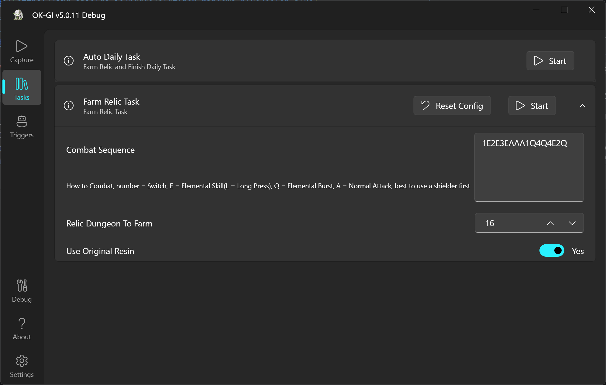
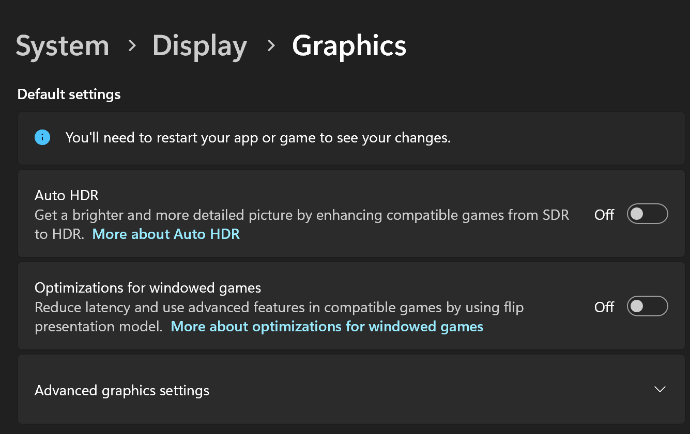
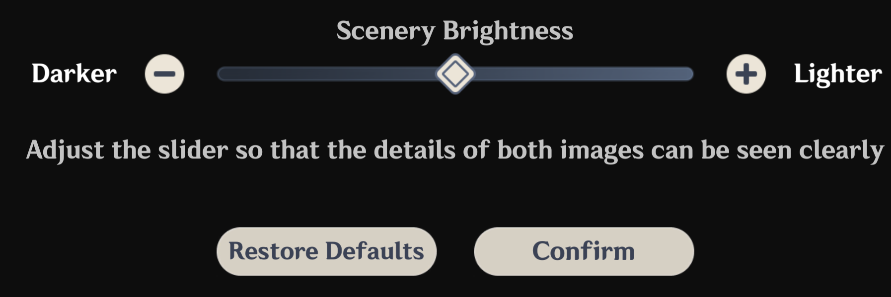
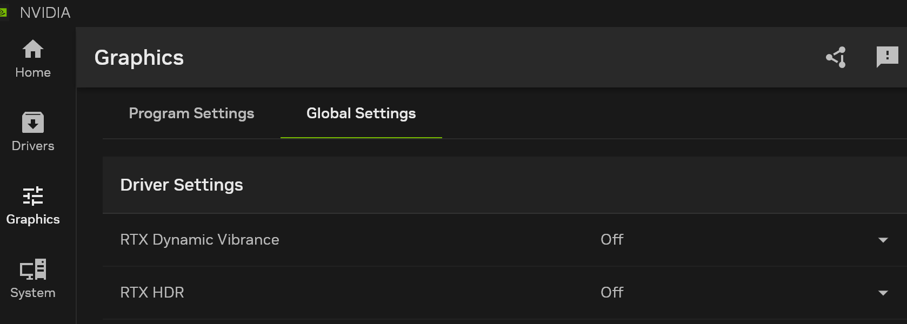

<div align="center">
  <h1 align="center">
    
    <br/>
    OK-GI
  </h1>
  <h3><i>使用计算机视觉和Win32API进行《原神》自动化</i></h3>
</div>

[](https://www.microsoft.com/en-us/windows/)
[](https://github.com/ok-oldking/ok-genshin-impact/releases)
[](https://github.com/ok-oldking/ok-genshin-impact/releases)
[](https://discord.gg/vVyCatEBgA)
[](https://pd.qq.com/s/e2wvbypn7)

演示和教程 [](https://youtu.be/9iURRmXQHew)

**说明:** [English](README_EN.md) | [简体中文](README.md)

[⭐️ Star on GitHub](https://github.com/ok-oldking/ok-genshin-impact)



## 主要特性

* **后台自动化:** 游戏在后台时也可运行任务, 无需多用户远程。
* **一键日常和秘境清理:** 高效完成日常任务和圣遗物秘境。
* **自动跳过任务对话:** 自动跳过对话并在完成后接收通知。
* **自动拾取物品:** 自动拾取晶蝶、圣遗物、宝箱等, 无需配置黑白名单。
* **多语言支持:** 兼容所有游戏语言。

## 开始使用

### 绿色免安装版, 解压后双击ok-gi.exe, 下载后可应用内更新

* [GitHub下载](https://github.com/ok-oldking/ok-genshin-impact/releases), 免费网页直链, 不要点击下载Source Code,
  点击下载zip包
* [Mirror酱下载渠道](https://mirrorchyan.com/zh/projects?rid=okgi&source=ok-gi-readme), 国内网页直链, 下载需要购买CD-KEY,
  已有Mirror酱CD-KEY可免费下载
* [夸克网盘](https://pan.quark.cn/s/a1052cec4d13), 免费, 但需要注册并下载夸克网盘客户端

### 从源代码运行 (Python)

1. 确保已安装 Python 3.12。
2. 克隆仓库: `git clone https://github.com/ok-oldking/ok-genshin-impact`
3. 安装依赖项: `pip install -r requirements.txt`
4. 以管理员权限运行脚本: `python main.py`

### 关于游戏后台运行的说明

1. **游戏和系统限制：**
    * 由于《原神》和 Windows 操作系统本身的固有局限性，当您玩其他游戏（例如《鸣潮》，它会锁定您的鼠标位置）时，后台执行是不兼容的。
2. **鼠标和键盘锁定：**
    * 当任务需要游戏内角色移动或转向时，您的鼠标和键盘将被暂时锁定。这是《原神》在后台运行时所必需的。如果您在前台玩《原神》，则不会发生锁定。

### 命令行参数

```
ok-gi.exe -t 1 -e
```

- -t 或 --task 代表启动后自动执行第几个任务, 1就是第一个, 一条龙任务
- -e 或 --exit 加上代表如果执行完任务之后自动退出

## 重要游戏设置

* **禁用自动 HDR 和窗口化游戏优化:**
  
* **使用默认游戏亮度:**
  
* **禁用外部图形滤镜:** 请勿使用 Nvidia/AMD 游戏滤镜或鲜艳度/HDR 效果。
  

## 常见问题 (FAQ)

1. **解压问题:** 将压缩包解压到仅包含英文字符的目录中。
2. **杀毒软件干扰:** 将下载和解压目录添加到您的杀毒软件/Windows Defender 白名单中。
3. **显示设置:** 禁用 Windows HDR、护眼模式和自动颜色管理。使用默认游戏亮度并禁用外部叠加层 (FPS、GPU 信息)。
4. **自定义按键绑定:** 暂不支持任何自定义按键绑定，请使用默认的 F、E、Q、F1 等。
5. **版本过旧:** 确保您使用的是最新版本的 OK-GI。
6. **性能:** 在游戏中保持稳定的 60 FPS，如果需要，降低分辨率。
7. **进一步帮助:** 如果问题仍然存在，请提交错误报告。

## 免责声明

本软件是《原神》的外部自动化工具，仅通过游戏现有的用户界面进行交互。它符合所有适用的法律和法规。

本项目开源且免费，仅供个人学习和交流使用。严禁用于商业用途或盈利活动。开发者保留对本项目的解释权。

开发者不对使用本软件引起的任何问题负责。使用本软件进行付费代练服务是未经授权且不支持的。由此产生的任何后果均由用户自行承担。本软件未经授权销售，任何出售的版本都可能包含恶意代码。

本工具不修改游戏文件或代码，旨在增强用户体验，不提供不公平的优势。