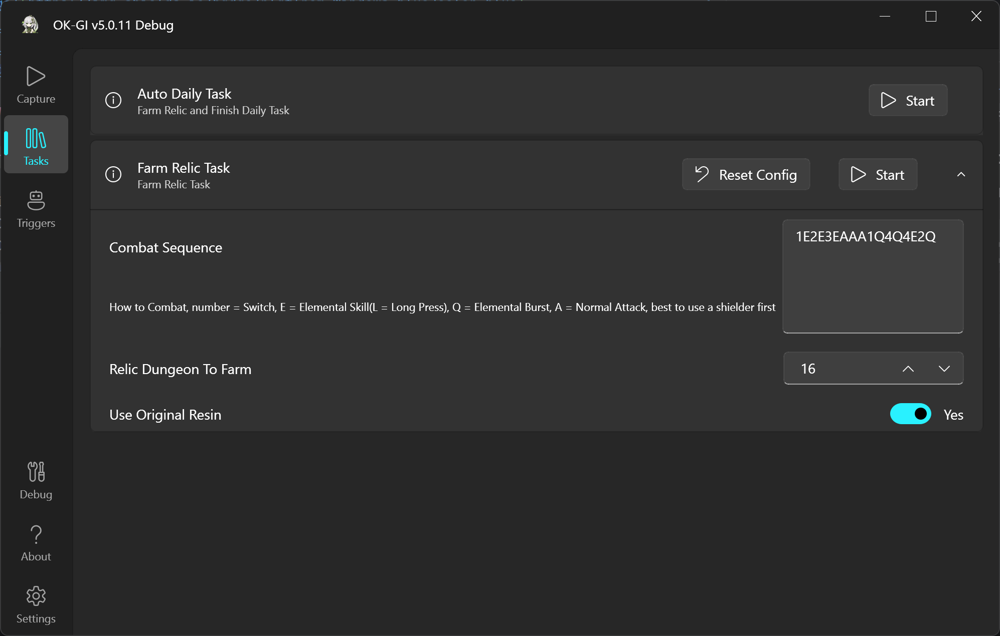
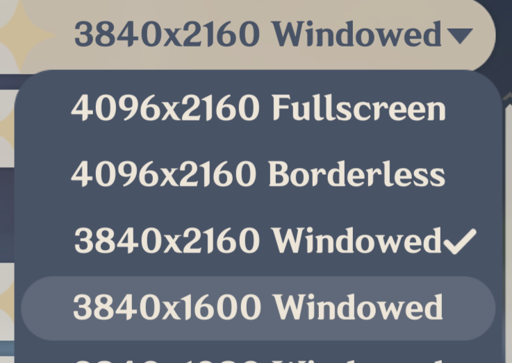
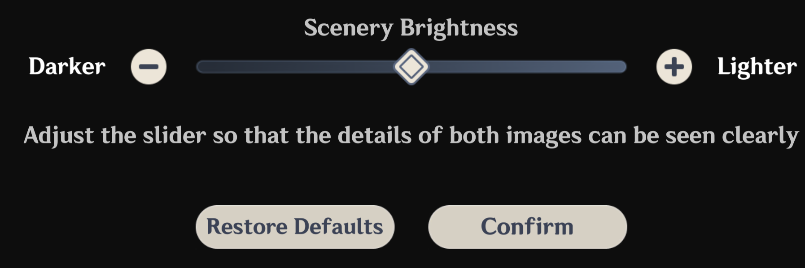

<div align="center">
  <h1 align="center">
    
    <br/>
      OK-GI
  </h1> 
<h3><i>Automation for Genshin Impact using Computer Vision and Win32API</i></h3>
</div>


[](https://github.com/ok-oldking/ok-genshin-impact/releases)
[](https://github.com/ok-oldking/ok-wuthering-waves/releases)
[](https://discord.gg/Q8utYcPQA3)

### English | [简体中文](README_cn.md)

It's free to use, and will be opensourced in the future.



## Key Features

* Can Run while the Game is in the Background.
* One Press Clear All Daily Tasks and Relic Domains
* Auto Skip Dialogs in Quests, Send Notification when Done
* Auto Pick-up (Butterflies, Relics, Chests etc)
* Supports All Game Languages

### Usage (Run from Compiled .exe)

* Download `ok-gi.7z` from the latest [releases](https://github.com/ok-oldking/ok-genshin-impact/releases)
* Extract and double-click the `ok-gi.exe`

### Usage (Run from Python Source Code)

Use Python 3.12, other versions might work but are not tested.

```
git clone https://github.com/ok-oldking/ok-wuthering-waves
pip install -r requirements.txt #install python dependencies
python main.py # run the python, must start with admin privillege
```

### Must Set Game Settings

* Turn Off Auto HDR and Optimization for windowed games
  

* Do Not use Fullscreen mode, use Borderless or Windowed
  

* Use Game's Default Brightness
  

* Do Not use Nvidia or AMD's Game filter/Vibrance/HDR effects
  

### FAQ

1. Do not extract in a directory with non-English characters.
2. Add the download and extraction directories to the antivirus software or Windows Defender whitelist, then extract the
   files again.
3. You may need to turn off Windows HDR, eye protection low blue light mode, and automatic application color management
   in advanced display settings. Use default brightness for games, disable all features that change game colors, like
   Nvidia/AMD game filters/sharpening, and close any overlays displaying FPS, GPU information, etc.
4. If you are not using the default QER keys, change the keys in the ok-ww settings. Mouse side buttons are not
   supported as shortcuts; otherwise, they will only perform basic attacks.
5. If OK-GI is not updated to the latest version, update to the latest version.
6. Ensure the game can run stably at 60fps
7. If you still have issues, submit a BUG report.

# Disclaimer

This software is an external tool designed to automate the gameplay of “Genshin Impact.” It interacts with the game
solely through the existing user interface and complies with relevant laws and regulations. The package aims to simplify
user interaction with the game without disrupting game balance or providing any unfair advantages. It does not modify
any game files or code.

This software is open-source and free, intended solely for personal learning and communication purposes, and is limited
to personal game accounts. It is not allowed for any commercial or profit-making purposes. The development team reserves
the final interpretation rights of this project. Any issues arising from the use of this software are unrelated to the
project and the development team. If you find merchants using this software for paid boosting services, it is their
personal behavior, and this software is not authorized for boosting services. Any issues and consequences arising from
such use are unrelated to this software. This software is not authorized for sale, and any sold versions may contain
malicious code, leading to the theft of game accounts or computer data, which is unrelated to this software.


