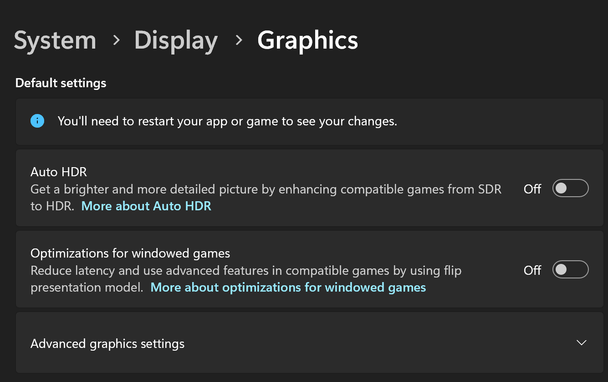
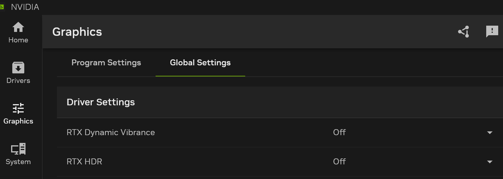

<div align="center">
  <h1 align="center">
    
    <br/>
    OK-GI
  </h1>
  <h3><i>Genshin Impact Automation with Computer Vision & Win32API</i></h3>
</div>

[](https://www.microsoft.com/en-us/windows/)
[](https://github.com/ok-oldking/ok-genshin-impact/releases)
[](https://github.com/ok-oldking/ok-genshin-impact/releases)
[](https://discord.gg/vVyCatEBgA)

**ReadMe:** [English](README_EN.md) | [简体中文](README.md)

**Free to use, will open-source in the future.**
**You can check out my wuthering waves project, [OK-WW](https://github.com/ok-oldking/ok-wuthering-waves)**


## Key Features

* **Based on OK-WW:** Using the same framework of the popular Wuthering Waves automation
  of [OK-WW](https://github.com/ok-oldking/ok-wuthering-waves)
* **Background Automation:** Run tasks while the game at background, no need for multi-user remote desktop.
* **One-Click Daily & Domain Clearing:** Efficiently complete daily tasks and relic domains.
* **Auto Quest Dialog Skip:** Automatically skip dialogues and receive notifications upon completion.
* **Auto Item Pickup:** Collect butterflies, relics, chests, and more automatically.
* **Multi-Language Support:** Compatible with all game languages.

## Getting Started

### Using the Compiled Executable (.exe)

1. Download the latest `ok-gi.7z` archive from
   the [releases page](https://github.com/ok-oldking/ok-genshin-impact/releases).
2. Extract the archive and double-click `ok-gi.exe`.

### Running from Source Code (Python)

1. Ensure you have Python 3.12 installed.
2. Clone the repository: `git clone https://github.com/ok-oldking/ok-genshin-impact`
3. Install dependencies: `pip install -r requirements.txt`
4. Run the script with administrator privileges: `python main.py`

### About Executing while Game is in background

1. **Game and System Constraints:**
    * Due to inherent limitations within the Genshin Impact and the Windows operating system, background execution is
      not compatible when you play another game, such as Wuthering Waves that locks your mouse in position.
2. **Mouse and Keyboard Locking:**
    * When tasks require in-game character movement or turning, your mouse and keyboard will be temporarily locked. This
      is necessary when Genshin Impact is at the background, if you play Genshin Impact in the foreground, locking won't
      happen.

### Command Line Arguments

```
ok-ww.exe -t 1 -e
```

- `-t` or `--task` represents the task number to execute automatically upon startup. `1` means the first task, a
  one-click execution task.
- `-e` or `--exit` when added, indicates that the program should automatically exit after the task is completed.

## Important Game Settings

* **Disable Auto HDR and Windowed Game Optimization:**
  
* **Use Borderless or Windowed Mode:** Fullscreen is not supported.
  
* **Use Default Game Brightness:**
  
* **Disable External Graphics Filters:** Do not use Nvidia/AMD game filters or vibrance/HDR effects.
  

## Frequently Asked Questions (FAQ)

1. **Extraction Issues:** Extract the archive to a directory with only English characters.
2. **Antivirus Interference:** Add the download and extraction directories to your antivirus/Windows Defender whitelist.
3. **Display Settings:** Disable Windows HDR, eye protection modes, and automatic color management. Use default game
   brightness and disable external overlays (FPS, GPU info).
4. **Custom Keybinds:** Does not support any custom key-bindings yet, use default F, E, Q, F1 etc.
5. **Outdated Version:** Ensure you are using the latest version of OK-GI.
6. **Performance:** Maintain a stable 60 FPS in the game, reduce resolution if needed.
7. **Further Assistance:** Submit a bug report if issues persist.

## Disclaimer

This software is an external automation tool for "Genshin Impact" that interacts solely through the game's existing user
interface. It complies with all applicable laws and regulations.

This project is open-source and free for personal learning and communication purposes. It is strictly prohibited for
commercial use or profit-making activities. The developers reserve the right to interpret this project.

The developers are not responsible for any issues arising from the use of this software. Using this software for paid
boosting services is unauthorized and not supported. Any consequences resulting from such use are the sole
responsibility of the user. This software is not authorized for sale, and any sold versions may contain malicious code.

This tool does not modify game files or code, and aims to enhance user experience without providing unfair advantages.